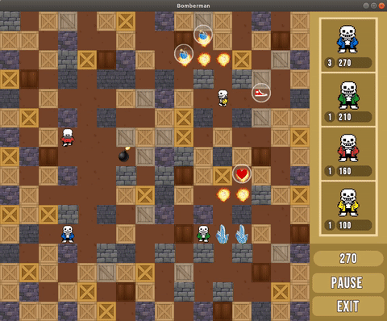
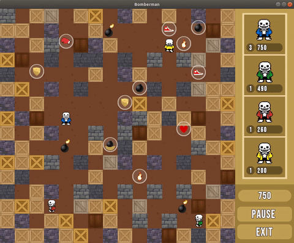
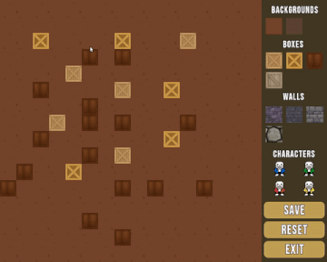
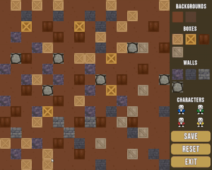

# Bomberman

## Introduction

A 2D game with level editor written in C++ with use of SFML library. Inspired by browser game "Bomb It".

## Features

- Game:
Placing bombs, collecting bonuses (shield, more bombs to use at once, increased bomb range, increased speed, ability to push bombs etc.). Collecting and using special weapons (digged bombs, fire, ice).
- Level editor: 
Placing boxes, walls and characters on the screen, changing backgrounds and saving designed levels in order to load them later.

## Launch (Linux)

- Make sure SFML is installed on your OS
- Clone the respository
- Enter the directory and run build file in your terminal: `./build.sh`
- Press `2` to compile the code
- After compilation, press `3` to run the game

## Credits

I do not own any right to image assets used in the game. I found these images on the Internet (CC license).

## Gameplay Preview

 
 
